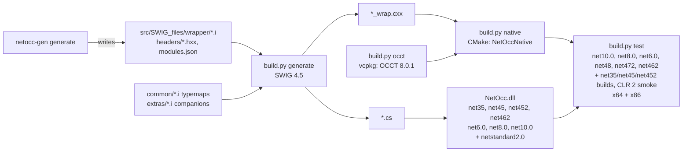

# netocc-core

SWIG-generated C# bindings for OCCT 8.0.1 in the pythonocc layout (`OCC.Core.<Package>`, OCCT names unchanged).
Sibling repo `../netocc-generator` writes `src/SWIG_files/{wrapper,headers}` and `src/SWIG_files/modules.json`; this repo builds and tests.
All 30 modules are generated (banner `generated by netocc-gen`). Don't edit generated files; change the generator or its `config/modules.yaml`. Hand-written: `src/SWIG_files/common/*.i` (the typemap library), `src/SWIG_files/extras/<Pkg>.i` (per-package companions the generated module includes) and `src/NetOcc/` (runtime, value-type structs).

## Architecture



## Commands

```bash
python build.py tools                        # once: SWIG into .tools/ (use CPython, not MSYS2 python)
python build.py occt --triplet x64-windows   # OCCT via vcpkg (x64 ~1 h, x86 ~1.3 h first time; cached after)
python build.py generate                     # after any .i change
python build.py native --triplet x64-windows # after generate; repeat for x86-windows
python build.py test --arch x64              # every framework, net35 on CLR 2; also --arch x86
python build.py pack --rids win-x64,win-x86  # NuGet into artifacts/packages (CI packs all four RIDs)
python build.py test-package --arch x64      # the packed NetOcc as an app consumes it
python build.py changelog --version 0.1.0    # a CHANGELOG.md section (release notes)
dotnet build NetOcc.slnx -c Release          # managed only
```

Redirect logs into `log/` (gitignored), never the repo root: `python build.py test --arch x64 > log/test-x64.log 2>&1`.

## Wrapper contract

- **Names:** OCCT class/method names unchanged, namespace `OCC.Core.<Package>`, SWIG module `<Package>Module` (internal).
- **References:** C++ `&` → C# `ref`, never `out`. Struct `const &` → `in`. Proxy-class `&` → plain parameter. `Handle(T)&` → `ref T`; it stays unchanged when the call throws.
- **Transients:** `%occt_transient(T)` before the class declaration (Handle ⇄ proxy, `DownCast`); the root `Standard_Transient` gets `%occt_handle`. The proxy owns one reference via SWIG `ref`/`unref`, so `IncrementRefCounter`, `DecrementRefCounter` and `Delete` aren't wrapped.
- **Enums:** a non-const `enum&` is `ref Enum` (`Types.i`, through an int slot).
- **Namespace functions** (OCCT 8 `TopoDS::Face`): a static class named like the namespace (`TopoDS.Face(s)`), generated as a shim struct `NetOcc_<Namespace>`.
- **Copyable proxy classes** (`TopoDS_*`, `TopLoc_Location`, `TDF_Label`, collections): `%occt_valueclass(T)`, so `const&` returns are owned copies. Collections: `%occt_list(NAME, T)` (0-based) and `%occt_sequence(NAME, T)` (1-based, like OCCT), both `IEnumerable<T>`.
- **OCAF tree keep-alive** (`extras/TDF.i`): proxies of `TDF_Label`, `TDF_Attribute` subclasses and `TNaming_Builder` hold one native reference on their `TDF_Data`. A class that holds attribute handles in private members needs `%occt_tdf_proxy` too, or releasing it after its document died crashes.
- **Value types** (`gp_*`, `Poly_Triangle`, `Quantity_Color`; the generator's `value_types`):
  - **Structs:** hand-written C# structs in `src/NetOcc/<Package>/`, `LayoutKind.Explicit`.
  - **Checks:** the generated `.i` has `%occt_valuetype(T)`, a `static_assert(sizeof/alignof/trivially_copyable)` with libclang's layout and `NetOcc_SizeOf_T()` for the size test in `ValueTypeTests`.
  - **Native thunks:** non-trivial methods are `%inline` thunks (`NetOcc_<Type>_<Method>`) in `extras/<Pkg>.i`.
  - **Managed math:** trivial math is managed, written from scratch.
- **Struct returns** go through a thread-local buffer (`ValueTypes.i`), never by value. By-value breaks on x86 stdcall.
- **Exceptions:** `%exception` catches `Standard_Failure` (OCCT 8: a `std::exception`; use `ExceptionType()`, `what()`) → `OcctException`.
- **Strings** (`Strings.i`), no proxy classes:
  - `const char*` and `TCollection_AsciiString` are UTF-8 `string`.
  - `TCollection_ExtendedString` is UTF-16 `string`.
  - A non-const `&` of either is `ref string`.
- **GUIDs:** `Standard_GUID` ⇄ `System.Guid` (`Guid.i`; OCCT 8's `Standard_UUID` has Guid's layout).
- **Declarations** are generated: the public API minus what can't map (logged with a reason in the generator's `log/skips/<Pkg>.txt`). Trailing `Message_ProgressRange` defaults are dropped; of overloads that map to one C# signature, the first stays.
- **Companions** (`extras/<Pkg>.i`), for what the generator can't derive: lifetime typemaps, value-type thunks, `%extend` + `%proxycode` (`Equals`/`GetHashCode`, bulk copies). The generated module includes its companion after the enums, before the classes; SWIG applies `%extend` there to the later class.
- **New package:** add it to netocc-generator's `config/modules.yaml` (`generate`, dependency order) and run `generate`. `build.py` reads the module order from `src/SWIG_files/modules.json`; each module's C# `using` list comes from its imports (`%netocc_csimports`). Write an `extras/<Pkg>.i` only for hand-written parts.

## Release and CI

- **`.github/workflows/build.yml`:** push, PR, manual or `v*` tag.
  - **Jobs:** natives on four runners (vcpkg binary cache in the Actions cache, saved right after OCCT), then pack, then package tests on Windows, Linux and macOS.
  - **A tag also publishes:** nuget.org through Trusted Publishing (no API key secret), then a GitHub release whose notes are the tag's CHANGELOG.md section. A tag without its section fails first.
- **Packages:**
  - `NetOcc` holds the managed assembly (MIT, Source Link, `.snupkg`) and depends on all four `NetOcc.runtime.<rid>` (`pack/`).
  - Those hold the natives, the `THIRD-PARTY-NOTICES.txt` (NOTICE plus every vcpkg port's license) that `build.py native` writes, and, on Windows, `build(Transitive)/net35` targets. They copy the natives into `x64\` or `x86\` for .NET Framework apps.
- **Releasing:** `/release <version>` (`.claude/skills/release/SKILL.md`). Changelog entries go into `[Unreleased]` in CHANGELOG.md as work lands (Keep a Changelog).

## Rules

- **Git:**
  - **`main` is a single commit** on `origin` (github.com/paulbuechner/netocc-core). Amend it with `git commit --amend --no-edit`, then publish with `git push --force-with-lease origin main`.
  - **Other sessions** (the Mac) work on branches and rebase them after each force-push, see `plan/macos-arm64-validation.md`.
- **License:** MIT only. No OCCT doc text in committed files. Never copy pythonocc code or lists (GPL-3.0/LGPL-3.0). OCCT notices live in `NOTICE`.
- **C#:**
  - Modern language features: file-scoped namespaces, switch/collection expressions, primary constructors, `readonly` struct members.
  - The lowest target is net35 (CLR 2): library code uses compiler-only features and .NET 3.5 APIs, or `#if NETFRAMEWORK`.
    - No tuple syntax: no `System.ValueTuple` below 4.7.
    - No `RuntimeInformation` (4.7.1), `AppContext` (4.6), `Encoding.GetString(byte*, int)` (4.6), `Environment.Is64BitProcess` (4.0), or `Path.Combine` with more than two parts (4.0).
  - Never implicit usings; explicit `using` directives in every file.
  - Using groups, blank-line separated, IDE order within each group:
    1. `System*` (no comment);
    2. each third-party package under `// <Package>` (`// NUnit`);
    3. project namespaces (`OCC.Core.*`) under `//`;
    4. `using static` under `// static usings`;
    5. `using X = Y;` aliases under `// alias directives`.
  - `.slnx` solutions.
  - Assembly attributes go into the csproj (`<InternalsVisibleTo Include="..." />`), not an `AssemblyInfo.cs`.
  - Don't edit generated code.
- **Tests:**
  - NUnit 4 with `Assert.That` constraints (`Is.EqualTo(x).Within(tol)`, `Throws.TypeOf<T>()`).
  - Explicit `// Arrange` / `// Act` / `// Assert` sections; one behavior per test.
  - Grouped asserts in `using (Assert.EnterMultipleScope())`.
  - `Action`, not the deprecated `TestDelegate`.
  - Non-ASCII paths and text: `NonAscii.Text` (`Ünïcödé`) and `NonAscii.CreateTempDirectory()`. Never real names.
- **License headers:** source code files only (`.cs`, `.i`, `.hxx`, `.py`) start with SPDX lines, in the comment style of the file type (`//`, `#`):
  `SPDX-FileCopyrightText: 2026 Paul Büchner` and `SPDX-License-Identifier: MIT`. None in project, build or config files (`.csproj`, `.slnx`, CMake, Dockerfile, workflow YAML).
- **Native library name:** `NetOccNative`, no dot (the Windows loader would treat `.Native` as the extension).
- **vcpkg:** run it through `build.py` only. It keeps every root under `.vcpkg/`; plain `vcpkg install` would use the global scoop tree.

## Gotchas

- **Build environment.** `build.py native` runs MSVC through `vcvarsall` + Ninja, because CMake 3.29 has no VS 2026 generator. Calling `cl` from Python needs its full path from the vcvars PATH.
- **OCCT exceptions.** Release OCCT defaults to `No_Exception`, which compiles out its precondition checks. The overlay triplets turn that off per port. Changing a triplet rebuilds OCCT.
- **Dependency lookup.** The OS loader resolves the TK DLLs next to the shim. The test project copies natives into `x64/` and `x86/`.
- **Typemap fallback.** SWIG falls back from `const T&` to `T&` for any typemap method missing on `const T&`. Every in/out typemap (`argout`) needs an empty `const T&` twin.
- **OCAF:**
  - Transactions need `SetUndoLimit(n > 0)`; with 0, `OpenCommand`/`AbortCommand` do nothing.
  - Close documents through the application: `TDocStd_Owner` keeps a raw document pointer that only `Close` clears.
  - `XCAFApp_Application` is a process-wide singleton, so tests close only their own documents.
- **Shipped natives:**
  - **macOS deployment target:** 14.0, set in `vcpkg/triplets/arm64-osx-dynamic.cmake` and as `MACOS_DEPLOYMENT_TARGET` in `build.py`; keep both in sync. Without it every dylib gets `minos` = the SDK version.
  - **Staging:** `build.py native` flattens the Linux/macOS stage to one file per library, named by its SONAME or install name. The symlink chains would otherwise be copied (and packed) in full: 237 MB instead of 79 MB on macOS. It also drops `pkgconfig/`.
  - **Linux:** CI builds on ubuntu-22.04, so glibc 2.35 is the floor. **Windows:** the natives need the Visual C++ 2015-2022 runtime.
- **Packing:**
  - `build.py pack` hands the RID list to the NetOcc restore as an environment variable, because `-p:` splits values at `;` and `,`.
  - It passes the sources as a generated `nuget.config`, because right after the runtime packs, two `--source` options made NuGet read nuget.org as a local path.
  - The runtime packages carry empty `lib/net35` and `lib/netstandard2.0` placeholders. Without them `build/net35` makes NuGet treat them as .NET Framework-only.
- **.NET 6 is out of support.** VSTest 18 and NUnit3TestAdapter 6 dropped it, so the test project pins Microsoft.NET.Test.Sdk 17.13.0 and NUnit3TestAdapter 5.2.0 for net6.0 only. Don't bump those two. `CheckEolTargetFramework=false` silences NETSDK1138. Running net6.0 on x86 needs the x86 .NET 6 runtime.
- **.NET Framework tests.** net462, net472 and net48 compile against their reference assemblies and run on the installed 4.8.x CLR; they load the library's net462 build.
  - **Older builds:** NUnit 4 and VSTest need 4.6.2, so `build.py test` runs the net48 suite against the net45 and net452 builds via `-p:NetOccTarget=<tfm>`. That's `SetTargetFramework` with `GlobalPropertiesToRemove="RuntimeIdentifier;SelfContained"`; without it the tests would get a RID-specific instead of the AnyCPU build.
  - **CLR 2:** the net35 target of `NetOcc.Tests` is an exe on NUnit 3.14 that runs itself through NUnitLite (`Net35.cs`), since VSTest can't host CLR 2. `build.py test` starts it on x64 and x86. It needs the .NET Framework 3.5 Windows feature; without it the run is skipped with a warning.
  - **Test code must compile for net35:**
    - no tuples (`ValueTuple`);
    - no `Marshal.SizeOf<T>` (4.5.1);
    - two-part `Path.Combine` only;
    - no `Environment.Is64BitProcess`.

    NUnit 3 has no `Assert.EnterMultipleScope`; `Net35.cs` adds one that stops at the first failure.
  - **Untested:** no test consumes the netstandard2.0 build.
- **Off Windows,** `build.py test` runs only the .NET targets; the .NET Framework ones build there but don't run.
- **Stale test binaries.** `dotnet test --arch x64|x86` builds into RID folders (`bin/Release/net48/win-x64/`), so `--no-build` runs whatever was built there last. Use `build.py test`, which always builds.
- **Platforms:**
  - **macOS:** green on arm64 for net10.0/net8.0/net6.0 with the Phase 0 modules. The re-run with the generated ones, the new deployment target and the flattened stage is pending (`plan/findings/osx-arm64.md`; guide `plan/macos-arm64-validation.md`).
  - **Linux:** `docker/linux-x64.Dockerfile` builds, tests, packs and consumes a linux-x64 package (OCCT about 25 min in the container). It needs Docker Desktop running.
  - **CI:** `build.yml` hasn't run yet.
