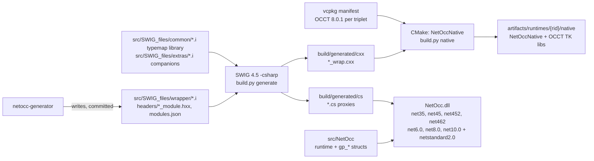
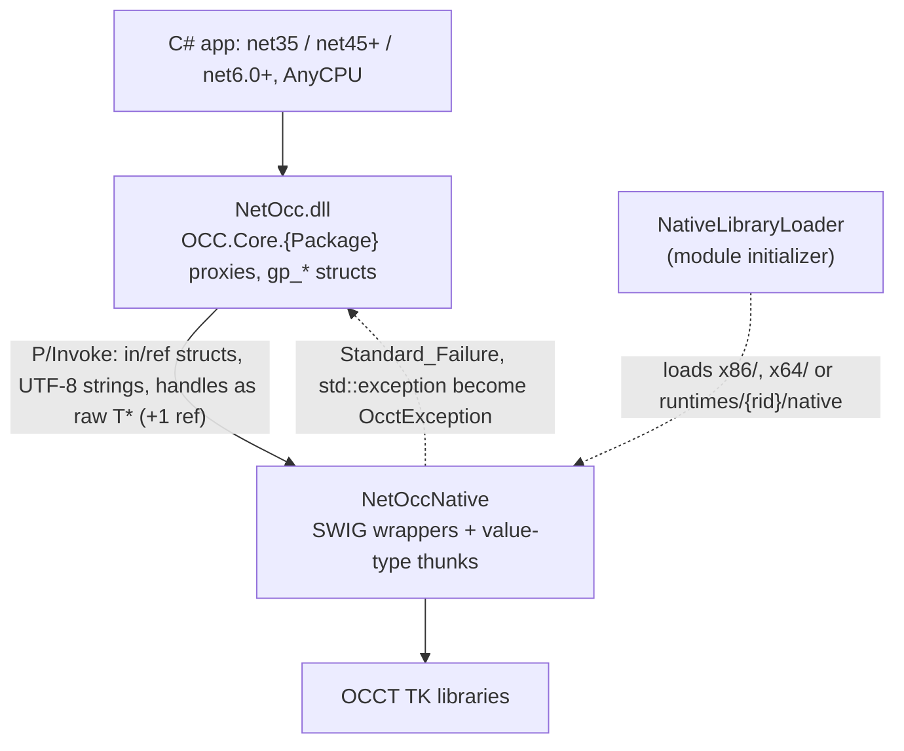

# netocc-core

OCCT (Open CASCADE Technology) for .NET: SWIG-generated C# bindings with the pythonocc layout.
One AnyCPU package for .NET Framework 3.5 and 4.5+, .NET 6, .NET 8 and .NET 10; natives for win-x86, win-x64, linux-x64, osx-arm64.

Status: **Phase 1**, 30 packages (modeling, meshing, STEP, OCAF/XCAF), all generated by netocc-generator. Tests green on win-x64 and win-x86 (every framework; net35 also on CLR 2) and linux-x64 (net10.0, net8.0, net6.0). osx-arm64 passed with the Phase 0 files; the re-run with the generated ones is pending.

## Install

```bash
dotnet add package NetOcc
```

`NetOcc` pulls in the natives of all four platforms (`NetOcc.runtime.<rid>`). They need:
- **Windows:** the Visual C++ 2015-2022 runtime, x64 or x86.
- **Linux:** glibc 2.35 or newer.
- **macOS:** 14 or newer, on Apple silicon.

.NET apps load the natives from `runtimes/<rid>/native`. .NET Framework apps get them in `x64\` and `x86\` next to the app, so AnyCPU works.

Changes per release: [CHANGELOG.md](CHANGELOG.md).

## Repos

Two repos, like pythonocc:

| Repo | pythonocc | Role |
|---|---|---|
| netocc-core (this) | pythonocc-core | typemap library, per-package `.i` (committed), build, C# assembly, tests; builds without the generator |
| netocc-generator | pythonocc-generator | reads OCCT headers, writes `src/SWIG_files/{wrapper,headers}` here; runs on OCCT upgrades |

```csharp
using OCC.Core.BRepAlgoAPI;
using OCC.Core.BRepPrimAPI;
using OCC.Core.gp;

var box = new BRepPrimAPI_MakeBox(10, 20, 30).Shape();
var cyl = new BRepPrimAPI_MakeCylinder(new gp_Ax2(new gp_Pnt(5, 5, 0), new gp_Dir(0, 0, 1)), 3, 40).Shape();
var fused = new BRepAlgoAPI_Fuse(box, cyl).Shape();
```

## Architecture

Build pipeline:



Runtime layers:



## Build

Needs Python (CPython, not MSYS2), vcpkg (`VCPKG_ROOT`), CMake + Ninja, .NET SDK 8+, and on Windows Visual Studio with C++ tools.

```bash
python build.py tools                        # SWIG 4.5 into .tools/ (pip venv)
python build.py occt --triplet x64-windows   # OCCT 8.0.1 via vcpkg manifest, all state in .vcpkg/
python build.py generate                     # SWIG -> build/generated/{cxx,cs}
python build.py native --triplet x64-windows # NetOccNative + OCCT libs -> artifacts/runtimes/win-x64/native
python build.py test --arch x64              # NUnit on every framework + net35 on CLR 2
```

Triplets: `x64-windows`, `x86-windows`, `x64-linux-dynamic`, `arm64-osx-dynamic` (overlays in `vcpkg/triplets`: release-only, OCCT built with its precondition checks enabled). Linux locally: `docker/linux-x64.Dockerfile`.

## Layout

| Path | Content |
|---|---|
| `src/SWIG_files/common` | typemap library: handles, value types, exceptions, UTF-8 strings, collections |
| `src/SWIG_files/wrapper` | one `.i` per OCCT package, committed netocc-generator output; declarations only |
| `src/SWIG_files/headers` | `<Package>_module.hxx` aggregate headers (generated) |
| `src/SWIG_files/extras` | hand-written companions the generated `.i` include: lifetime typemaps, value-type thunks, `%extend` |
| `src/SWIG_files/modules.json` | module build order (generated) |
| `src/NetOcc` | C# project: runtime (native loader, `OcctException`), value-type structs, generated proxies |
| `test/NetOcc.Tests` | NUnit 4 spike tests (modeling, mesh, STEP, handles, exceptions, layouts, GC stress, OCAF, XCAF) |
| `test/NetOcc.PackageTests` | the packed NetOcc from `artifacts/packages`, consumed like an app (`build.py test-package`) |
| `pack` | `NetOcc.runtime.<rid>` packages: natives, license notices, .NET Framework copy targets |
| `.github/workflows/build.yml` | CI on four runners; a `v*` tag publishes to nuget.org and creates the GitHub release |
| `CHANGELOG.md` | release notes, one section per version (Keep a Changelog) |
| `plan` | handoffs between sessions (`macos-arm64-validation.md`) and their findings (`findings/`) |

License: MIT, see `LICENSE`. OCCT is LGPL-2.1 with the Open CASCADE exception, see `NOTICE`.
