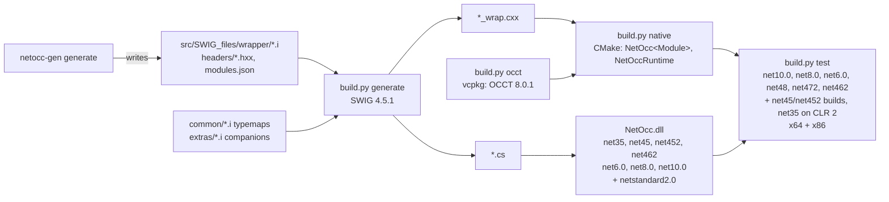

# netocc-core

SWIG-generated C# bindings for OCCT 8.0.1: one namespace per OCCT package (`OCC.Core.<Package>`), OCCT names unchanged.
The monorepo's `../netocc-generator` writes `src/SWIG_files/{wrapper,headers}`, `src/SWIG_files/modules.json` and `classes.json` (the documentation's class index reads it); this folder builds and tests. Monorepo rules: `../CLAUDE.md`.
All 362 packages of OCCT's FoundationClasses, ModelingData, ModelingAlgorithms, ApplicationFramework and DataExchange modules and of Visualization's TKService, TKV3d, TKOpenGl (the driver) and TKMeshVS are generated (banner `generated by netocc-gen`), plus `TColgp`, `TColGeom` and `TColGeom2d`, which hold collections only. Don't edit generated files; change the generator or its `config/modules.yaml`. Hand-written: `src/SWIG_files/common/*.i` (the typemap library), `src/SWIG_files/extras/<Pkg>.i` (per-package companions the generated module includes), `src/Native/` (native helpers, the NetOccRuntime library) and `src/NetOcc/` (runtime; the managed partials of the value-type structs, whose `*.g.cs` are generated).

## Architecture



## Commands

```bash
python build.py tools                        # once: SWIG from conda-forge into .tools/ (micromamba, pinned in build.py)
python build.py occt --triplet x64-windows   # OCCT via vcpkg (x64 ~1 h, x86 ~1.3 h first time; cached after)
python build.py generate                     # after any .i change
python build.py native --triplet x64-windows # after generate; repeat for x86-windows
python build.py test --arch x64              # every framework, net35 on CLR 2; also --arch x86
python build.py pack --rids win-x64,win-x86  # NuGet into artifacts/packages (CI packs all four RIDs)
python build.py test-package --arch x64      # the packed NetOcc as an app consumes it
python build.py changelog --version 0.1.0    # a CHANGELOG.md section (release notes)
dotnet build NetOcc.slnx -c Release          # managed only
```

Redirect logs into `log/` (gitignored), never the repo root: `python build.py test --arch x64 > log/test-x64.log 2>&1`.

## Wrapper contract

- **Names:** OCCT class/method names unchanged, namespace `OCC.Core.<Package>`, SWIG module `<Package>Module` (internal).
  - Nested and namespace types have flat names, their scopes joined by `_` (`Geom_Curve::ResD1` is `Geom_Curve_ResD1`, `gp_Dir::D` is `gp_Dir_D`), which the generated `headers/<Pkg>_nested.hxx` declares as C++ aliases.
  - A class template instance OCCT names with an alias next to the template is a class or struct of that name (`BRepGraph_FaceId`, `BRepGraph_FaceIterator`).
- **References:** C++ `&` → C# `ref`, never `out`. Struct `const &` → `in`. Proxy-class `&` → plain parameter (a transient's too). `Handle(T)&` → `ref T`; the variable keeps its proxy unless the callee puts another object there (not after a C++ exception or a failed argument check).
  - Numbers (`Types.i`, `References.i`): every fixed-width integer, width typedefs by their written names (`int64_t&` is `long&` on Linux); `char` is its `byte`, by value and as `ref byte` (its bits: the sign differs per platform, and a C# `char` would pass through a code page), `size_t&` `ref ulong`, `char32_t` a `uint` (a UTF-32 code point). C `long` (32-bit on Windows) is a C# `long`, range-checked (OcctException `Standard_OutOfRange`). `Standard_GUID&` is `ref Guid` (`Guid.i`).
- **Transients:** `%occt_transient(T)` before the class declaration (Handle ⇄ proxy, `DownCast`); the root `Standard_Transient` gets `%occt_handle(T, T)` (C++ type, C# name). The proxy owns one reference via SWIG `ref`/`unref`, so `IncrementRefCounter`, `DecrementRefCounter` and `Delete` aren't wrapped. A handle-managed template instance gets `%occt_transient_instance(T, NAME)`: SWIG keeps only its first base for C#, so the reference counting is declared on it.
- **Enums:** a non-const `enum&` is `ref Enum` (`References.i`, through an int slot); an enum on another type (`enum BitLayout : uint16_t`) keeps it as its C# base and has no `ref`. Nested enums are `enum class` in the `.i`.
- **Namespace functions** (OCCT 8 `TopoDS::Face`): a static class named like the namespace (`TopoDS.Face(s)`), generated as a shim struct `NetOcc_<Namespace>`.
- **Copyable proxy classes** (`TopoDS_*`, `TopLoc_Location`, `TDF_Label`, collections): `%occt_valueclass(T)`, so `const&` returns are owned copies.
- **References a member returns** (`References.i`): `T&`, and `const T&` of a class C# can't copy.
  - A number, enum or struct is a C# `ref` into the object: `fix.FixReorderMode() = 1` (`%netocc_ref_out`).
  - A class or collection is a proxy that borrows the object: it doesn't own it (`Dispose` leaves it) and its `netoccOwner` keeps the owner's proxy alive. Every proxy body has that field, `TDF.i`'s too.
  - A `Handle(T)&` is the object; the member's own class (chaining) is `void`. Static functions return no references (no owner).
  - A `size_t&` is a `ref UIntPtr`: four bytes on win-x86, as `size_t` is.
- **Pointers** (`Types.i`, `References.i`, `Handles.i`):
  - **Class or collection:** its proxy, `null` for `nullptr`. A member's return borrows the object and keeps the owner's proxy alive (`T*` in the `.i`); a return without an object keeps none (`T* const`). A transient's return owns a reference (`T* const`: SWIG applies the out typemap of `T*` to constructors, whose reference the `ref` feature adds). `T*&` is `ref T`; a new pointer comes back borrowed, a transient's owning a reference.
  - **Numbers and structs:** a C# array pinned for the call (`double[]`, `gp_Pnt[]`; `T[N][M]` is `T[,]`). A `bool[]` goes through bytes C# copies to and back (`NativeArrays`): the marshaler's bool arrays differ between runtimes (CLR 2 writes back four-byte BOOLs). A constructor or `Set*` method may keep the pointer, so it gets an address instead.
  - **Addresses** (`IntPtr`): `void*`, functions, pointers to pointers, returned number or struct pointers, classes no header defines. `NetOcc_Address< T >` converts to T in the wrapper; a module calls `%netocc_address(%arg(T))` per T. `T*&` of those, and a member's `T*&` return: `ref IntPtr` (`NetOcc_AddressRef< T >`).
  - `const char16_t*` (`Standard_ExtString`) is a UTF-16 `string`, `char16_t` a `char`, `const char*&` a `ref string`, `std::ostream*`/`std::istream*` a lent `Stream` (`null`: `nullptr`).
  - Width typedefs keep their name in pointers (`const uint64_t*`, `intptr_t*`): `int64_t*` is `long*` on Linux, `intptr_t*` `int*` on x86. `intptr_t`, `uintptr_t` and `ptrdiff_t` are `IntPtr`/`UIntPtr`. `size_t` is a `ulong`: a value a 32-bit `size_t` can't hold throws `OcctException` (`Standard_OutOfRange`) on x86 (`NativeSize`).
  - A C array by reference (`int (&)[3]`, const too) is a C# array of its length, checked, which the callee reads and writes in place (`NetOcc_ArrayRef< T, N >`, `%netocc_array_ref`; `%netocc_bool_array_ref`: one byte each).
- **Collections** (`Collections.i`; `math_Vector` in `extras/math.i`): the instantiations signatures use.
  - **Names:** OCCT 8's deprecated aliases (`src/Deprecated/NCollectionAliases`: `TColgp_Array1OfPnt`), each in the package its prefix names. Without an alias, the template and its arguments, flattened (`NCollection_Array1_BRepGraph_NodeId`; a default hasher left out), in the package of its first user, or of its template when it holds numbers only (`OCC.Core.NCollection.NCollection_DynamicArray_int`).
  - **Macros** `(NAME, TYPE, CSTYPE)`: C# class, element's C++ type, element's C# type (`gp_Pnt`, `double`, `string`, `Geom_Curve` for a handle).
    - `%occt_array1`: indexer `Lower()`..`Upper()`, `IEnumerable<T>`, `Count`. `%occt_array1_blittable` adds `new NAME(T[])` (`Lower()` = 1) and `ToArray()`, one copy each, for numbers and value types.
    - `%occt_array2`: indexer `[row, col]`, bounds checked per axis (OCCT checks only the flat position).
    - `%occt_list`: `IEnumerable<T>` through an OCCT iterator the enumerator owns; no index access.
    - `%occt_sequence`: 1-based indexer, like OCCT.
    - `%occt_harray1`/`harray2`/`hsequence`: C# subclass of the plain collection, Handle ⇄ proxy, `DownCast`. The plain one is instantiated first.
    - Maps take the hasher too, C++ only: `(NAME, KEY, HASHER, CSKEY)`, `(NAME, KEY, ITEM, HASHER, CSKEY, CSITEM)`. `%occt_map` and `%occt_indexedmap` (1-based indexer) enumerate keys; `%occt_datamap` (indexer by key, `ContainsKey`, `TryGetValue`) and `%occt_indexeddatamap` (1-based indexer over items) enumerate `KeyValuePair`s. Macro arguments can't hold commas; inside a macro, `%arg(...)` passes a templated type on.
    - `%occt_math_vector`: `math_Vector`, `math_IntegerVector`; indexer, bulk copies, `+ - * /` (`vector * vector` is the dot product).
    - `%occt_linearvector` (`_blittable`: `new NAME(T[])`, `ToArray()`) and `%occt_dynamicarray` (`NCollection_Vector`): OCCT 8's vectors, indexer from 0, `Append`, `InsertBefore`, `EraseLast`. OCCT's accessors are unchecked: the C# members check the index and call them, internal; no `%extend`, whose calls SWIG casts with `enum X` for a vector of a nested enum.
    - `%occt_flatmap`, `%occt_flatdatamap`: OCCT 8's open-addressing maps, as `%occt_map` and `%occt_datamap`.
  - An argument that holds a comma comes through `%arg(...)`; the macros pass their types on through `%arg` too (a map of maps: `DE_Wrapper::Nodes`).
  - Shared bodies: `%netocc_iterator` and `%netocc_pair_iterator` (the enumerator's plumbing, in a template's `%extend`), `%netocc_iterator_cscode`, `%netocc_indexed_cscode` (Array1, Sequence), `%netocc_datamap_cscode`, `%netocc_vector_cscode`.
  - A module instantiates a collection after the ones it holds (bases, items).
  - A bad index throws `OcctException` (`Standard_OutOfRange`), a missing key too (`Standard_NoSuchObject`).
- **Class template instances** no collection macro covers (`BRepGraph_MutGuard<BRepGraphInc_VertexDef>`) are classes. An OCCT alias anywhere names one (`Extrema_ExtPC`, `IntPolyh_ArrayOfPoints`), else the template and its arguments, flattened (`BRepGraph_MutGuard_BRepGraphInc_VertexDef`; past 100 characters the arguments are a hash). The owner (first user, or the template's package for numbers only) declares the name as a C++ alias in its nested header. So do a class inside an instance (`<instance>_Iterator`) and an instance of a protected template that a public typedef in a class names (`ShapePersistent_Geom::Curve`).
  - **Range-for:** a class whose `begin()`/`end()` iterate its own More/Next/accessor (OCCT 8's `NCollection_ForwardRange`) is `IEnumerable<T>` (`%occt_forward_range`); `foreach` advances it, as range-for does.
  - **Move-only** classes (a guard) return by value into an owned proxy (`SwigValueWrapper` moves; MSVC needs `/Zc:__cplusplus`). `Dispose` runs the destructor.
- **Lifetimes C++ keeps:** a C++ reference doesn't reach the GC, so what an object keeps a reference to lives in its proxy's `netoccOwner` (`References.i`, `NativeKeep`). netocc-gen marks a class or collection argument by reference or pointer that the class refers to through a pointer or reference field of its own or of a base (any access; not a collection's storage).
  - **Constructor arguments** (the graph of a `BRepGraph_FaceIterator`, a boolean's shared `BOPAlgo_PaveFiller`): `%apply SWIGTYPE & NETOCC_KEEP { decl }` around the declaration, `%netocc_keep_construct(Class)` before the class. SWIG converts them in a static helper, before the proxy exists: after the call (`post`), `NativeKeep` holds them until the constructor body takes them.
  - **By-value returns** of such a class from a member keep the member's object (a `BRepGraph_MutGuard` points into its graph): `%netocc_keep_construct`'s `csout`. A static member returning one wouldn't compile (no `this`); OCCT has none.
  - Both stay held until the GC has collected the proxy, past its finalizer: finalizers run in any order, and the destructor may use them (the guard's clears its item in the graph). A table with long weak references does it; a finalizer object sweeps it after full collections.
  - **Member arguments** (`Extrema_ExtPS::Initialize(surface)`): `%netocc_keep_argument(Member.index, decl)`, non-static non-const members only. The proxy keeps the argument in place of what the member's previous call kept at that position, for its own life only: an argument may be borrowed from the object itself, and the table would keep both forever.
  - Handles need nothing (reference counts). A struct or string argument can't be kept: C# passes a copy or a pinned struct for the call.
- **OCAF tree keep-alive** (`extras/TDF.i`): proxies of `TDF_Label`, `TDF_Attribute` subclasses and `TNaming_Builder` hold one native reference on their `TDF_Data`. A class that holds attribute handles in private members needs `%occt_tdf_proxy` too, or releasing it after its document died crashes.
- **Value types** (all of `gp` but the static `gp` class, `Bnd_Box(2d)`, `Quantity_Color(RGBA)`, `Poly_Triangle`; the generator's `value_types`), and plain data (public fields only, each a number, enum, value type or plain data: `Geom_Curve_ResD1`):
  - **Generated struct** `src/NetOcc/<Package>/<Type>.g.cs`: `LayoutKind.Explicit` with C++'s fields and offsets, private in value types, public in plain data.
    - Names are C++'s (`coord`, `myMat_0_1` for arrays, `myRgb_v_0` for members of a nested non-value class); `bool` fields are `byte`.
    - Imports go inside the namespace, as in SWIG's files: there an imported type beats a sibling namespace of its name (the class `BRepGraph` from `OCC.Core.BRepGraphInc`).
    - Every member calls a native `%inline` thunk (`NetOcc_<Type>_<Member>`, in the generated `.i`) with `in this` or `ref this`, a `const T&`/`T&` there (`T*` parameters are arrays). Constructors assign `theSelf = T(...)`, and `+ - * / ^` and unary `-` become C# operators. A member returning a pointer into the struct is left out: the GC may move the struct.
  - **Hand-written partial** `<Type>.cs`: managed math, written from scratch. The generator leaves out every member the partial declares, by name and parameter types (`in T` counts as `T`). The partial declares no fields and no layout.
  - **Checks:** the generated `.i` has `%occt_valuetype(T)`, a `static_assert(sizeof/alignof/trivially_copyable)` with libclang's layout (enum fields sized as their underlying type) and `NetOcc_SizeOf_T()`. `ValueTypeTests` finds every struct by reflection and compares the sizes.
- **Struct returns** go through a thread-local buffer (`ValueTypes.i`), never by value. By-value breaks on x86 stdcall.
- **Exceptions:** `%exception` catches `Standard_Failure` (OCCT 8: a `std::exception`; use `ExceptionType()`, `what()`) → `OcctException`.
  - OCCT's exception classes are copyable proxies too (`new Standard_OutOfRange("bad index").what()`), not .NET exceptions.
  - `OcctException.Is<T>()` checks the raised class against their hierarchy: `e.Is<Standard_DomainError>()` holds for a `Standard_ConstructionError`.
- **Strings** (`Strings.i`), no proxy classes:
  - `const char*` and `TCollection_AsciiString` are UTF-8 `string`.
  - `TCollection_ExtendedString` is UTF-16 `string`.
  - A non-const `&` of either is `ref string`.
  - Of string overloads C# can't tell apart, the UTF-16 one is wrapped (`TCollection_ExtendedString`, `const char16_t*`): a `const char*` one may copy the UTF-8 bytes as Latin-1 (`TCollection_HExtendedString(const char*)`).
- **Standard library types** (`Std.i`; the strings in `Strings.i`):
  - `std::string`, `std::string_view` and a `const std::stringstream&` (its text) are UTF-8 `string`s; `std::streampos` is a `long`.
  - `std::bitset<N>` (N ≤ 64) is a `ulong` mask; `std::array<T, N>` of numbers a `T[]` of N elements (checked); `std::optional<T>` of a number, enum or struct a `T?`; `std::complex<double>` an `OCC.Core.Complex`.
  - `std::pair<T1, T2>` is a class with `First` and `Second` (copies), instantiated like a collection: OCCT's alias in a class (`XSAlgo_ShapeProcessor_ProcessingData`) or `std_pair_<T1>_<T2>`. Its accessors are `%extend`, so it can't hold a nested enum.
  - netocc-gen calls a macro per instantiation: `%netocc_bitset(N)`, `%netocc_std_array(T, N, CS)`, `%netocc_optional(T, CS)`, `%netocc_pair(NAME, T1, T2, CS1, CS2)`. Not wrapped: `std::shared_ptr` streams, mutexes, `std::initializer_list`, `std::variant` (the skip list).
- **GUIDs:** `Standard_GUID` ⇄ `System.Guid` (`Guid.i`; OCCT 8's `Standard_UUID` has Guid's layout).
- **Streams** (`Streams.i`): `std::ostream&`/`std::istream&` (`Standard_OStream&`) are a `System.IO.Stream` lent for the call.
  - OCCT writes into a native memory stream, whose bytes `NativeOutput` copies to the C# stream afterwards, even after a failed call. For reading, `NativeInput` pins the C# stream's remaining bytes and OCCT reads them in place; a seekable stream then stands where OCCT stopped.
  - The memory streams (`src/Native/NetOccStreams.cxx`) seek, as binary formats need. Nothing calls back into C# during the call.
  - Constructors and classes with a stream member get no stream parameters (OCCT may keep the stream). A function returning the stream it was given is `void`.
- **Visualization** (`AIS`, `V3d`, `Graphic3d`, `Prs3d`, `StdPrs`, `SelectMgr`, `MeshVS`, `Font`, `Image`, ...): without OpenGl's renderer (only `OpenGl_GraphicDriver` and `OpenGl_Caps`: the renderer's classes declare per platform), VTK, GLES, Direct3D, and the platforms' window packages (WNT, Xw, Cocoa, Wasm).
  - A window for a native handle: `Aspect_Window.FromNativeHandle(handle, display)` (`extras/Aspect.i`): an HWND on Windows, an NSView on macOS, an X11 window with its `Aspect_DisplayConnection` on Linux.
  - Window-system handles (`Aspect_Drawable`, `Aspect_Handle`, `Aspect_RenderingContext`, `Aspect_Display`, `Aspect_FBConfig`) are `IntPtr`s, spelled by name in the `.i`: `void*` on Windows, `unsigned long` or an Objective-C pointer elsewhere (`Types.i`). A pointer to one is an address.
  - Without a GPU (CI), an `OpenGl_GraphicDriver(null, false)` computes presentations and selection; rendering needs a window.
- **Deprecated** OCCT classes and members (`Standard_DEPRECATED`) are wrapped and `[Obsolete("Deprecated in OCCT.")]`; OCCT's message stays out (no OCCT text). The generated code uses them, so the natives build with `/wd4996` (`-Wno-deprecated-declarations`) and NetOcc with CS0612/CS0618 off.
- **Declarations** are generated: the public API minus what can't map (logged with a reason in the generator's `log/skips/<Pkg>.txt`). Trailing `Message_ProgressRange` defaults are dropped where the call stays unambiguous, and so is a trailing parameter C# can't pass when it and the ones after it have defaults (a C# call gets OCCT's). A call only two overloads fit (`IntPolyh_Array(int = 256)` next to `(int, int = 256)`) is left out, as in C++; the other arities stay. A `= {}` default is written `TYPE()`.
  - **Accessors** (`%extend` + `%rename`, the member's name in C#): a transient returned by value is constructed in place (`new T(...)`: C++17 elides the copy, so it needn't be copyable) and owned by its proxy (`BRepGraph_Tool_Edge.CurveAdaptor`); a static member's class reference is a proxy that borrows it, no owner (`MoniTool_Stat.Current`). Of overloads that map to one C# signature (const twins, string encodings, a pointer next to a reference), C# gets one: a twin returning a C# `ref` to a value (`matrix.Value(1, 2) = 5.0`), then the one with more UTF-16 strings, then the first declared. OCCT's `GetType()` (curve and surface types) hides `object.GetType()`. A class that declares no constructor gets its implicit default one (`new BRep_Builder()`); `%nodefaultctor` stays global.
- **Companions** (`extras/<Pkg>.i`), for what the generator can't derive: lifetime typemaps, `%extend` + `%proxycode` (`Equals`/`GetHashCode`, bulk copies), accessors for what SWIG can't declare (`ShapeProcess.ToOperationFlag`: a pair of a nested enum), native references for tests. The generated module includes its companion after the enums, before the classes; SWIG applies `%extend` there to the later class.
- **New package:** add it to netocc-generator's `config/modules.yaml` (`generate` takes packages, toolkits or modules, in any order) and run `generate`. `build.py` reads the module list from `src/SWIG_files/modules.json`; each module's C# `using` list comes from its imports (`%netocc_csimports`). Write an `extras/<Pkg>.i` only for hand-written parts.

## Release and CI

- **`../.github/workflows/build.yml`** (the monorepo root; keep its name, nuget.org's policy names it): pushes and PRs that change `netocc-core/`, manual, `v*` tags (never path-filtered), and Mondays and Thursdays at 04:17 UTC. Run steps work in `netocc-core/`; action paths (artifacts, caches) start with `netocc-core/`. The schedule keeps the vcpkg caches, which GitHub evicts after 7 unused days. GitHub disables it after 60 days without repository activity.
  - **Jobs:** natives on four runners, then pack, then package tests on Windows, Linux and macOS.
  - **vcpkg cache:** `.vcpkg/archives` per triplet in the Actions cache. Right after OCCT, `occt --prune-archives` drops the archives the install doesn't use, and a changed set is saved under a new key; a restore takes the newest. The package ABIs cover the runner image too (compiler, CMake): a new image can rebuild OCCT once, about an hour.
  - **A tag also publishes:** nuget.org through Trusted Publishing (no API key secret), then a GitHub release whose notes are the tag's CHANGELOG.md section. A tag without its section fails first.
- **Packages:**
  - `NetOcc` holds the managed assembly (MIT, Source Link, `.snupkg`) and depends on all four `NetOcc.runtime.<rid>` (`pack/`).
  - Those hold the natives, the `THIRD-PARTY-NOTICES.txt` (NOTICE plus every vcpkg port's license) that `build.py native` writes, and, on Windows, `build(Transitive)/net35` targets. They copy the natives into `x64\` or `x86\` for .NET Framework apps.
- **Releasing:** `/release <version>` (`../.claude/skills/release/SKILL.md`). Changelog entries go into `[Unreleased]` in CHANGELOG.md as work lands (Keep a Changelog).

## Rules

- **Git:**
  - **`main` is a single commit** on `origin` (github.com/paulbuechner/netocc, the monorepo). Amend it with `git commit --amend --no-edit`, then publish with `git push --force-with-lease origin main`.
  - **Other sessions** (the Mac) work on branches and rebase them after each force-push, see `plan/macos-arm64-validation.md`.
- **License:** MIT only. No OCCT doc text in committed files. Never copy code or lists from other OCCT bindings (GPL-3.0/LGPL-3.0). OCCT notices live in `NOTICE`.
- **C#:**
  - Modern language features: file-scoped namespaces, switch/collection expressions, primary constructors, `readonly` struct members.
  - The lowest target is net35 (CLR 2): library code uses compiler-only features and .NET 3.5 APIs, or `#if NETFRAMEWORK`.
    - No tuple syntax: no `System.ValueTuple` below 4.7.
    - No `RuntimeInformation` (4.7.1), `AppContext` (4.6), `Encoding.GetString(byte*, int)` (4.6), `Environment.Is64BitProcess` (4.0), or `Path.Combine` with more than two parts (4.0).
  - Never implicit usings; explicit `using` directives in every file.
  - Using groups, blank-line separated, IDE order within each group:
    1. `System*` (no comment);
    2. each third-party package under `// <Package>` (`// NUnit`);
    3. project namespaces (`OCC.Core.*`) under `//`;
    4. `using static` under `// static usings`;
    5. `using X = Y;` aliases under `// alias directives`.
  - `.slnx` solutions.
  - Assembly attributes go into the csproj (`<InternalsVisibleTo Include="..." />`), not an `AssemblyInfo.cs`.
  - Don't edit generated code.
- **Tests:**
  - NUnit 4 with `Assert.That` constraints (`Is.EqualTo(x).Within(tol)`, `Throws.TypeOf<T>()`).
  - Explicit `// Arrange` / `// Act` / `// Assert` sections; one behavior per test.
  - Grouped asserts in `using (Assert.EnterMultipleScope())`.
  - `Action`, not the deprecated `TestDelegate`.
  - Non-ASCII paths and text: `NonAscii.Text` (`Ünïcödé`) and `NonAscii.CreateTempDirectory()`. Never real names.
- **License headers:** source code files only (`.cs`, `.i`, `.hxx`, `.py`) start with SPDX lines, in the comment style of the file type (`//`, `#`):
  `SPDX-FileCopyrightText: 2026 Paul Büchner` and `SPDX-License-Identifier: MIT`. None in project, build or config files (`.csproj`, `.slnx`, CMake, Dockerfile, workflow YAML).
- **Native libraries:** one per OCCT module, `NetOcc<Module>` (`NetOccModelingData`), from the groups of `modules.json`: a Windows DLL exports at most 65535 functions, and the wrappers export 71,000. Each links every OCCT module's toolkits (`CMakeLists.txt`), Visualization's too. `NetOccRuntime` holds `src/Native`. No dots in the names (the Windows loader would take `.Native` for the extension). `NativeLibraryLoader` resolves every `NetOcc*` name; on .NET Framework it preloads them all.
- **vcpkg:** run it through `build.py` only. It keeps every root under `.vcpkg/`; plain `vcpkg install` would use the global scoop tree.

## Gotchas

- **SWIG comes from conda-forge:** `build.py tools` downloads micromamba (`MICROMAMBA_VERSION`, checksum-verified) and creates `.tools/swig` with `swig=SWIG_VERSION` and its libraries (pcre2, the C++ runtime), so no conda install is needed and PyPI's lagging wheel doesn't matter. SWIG's library is `Library/bin/Lib` on Windows, `share/swig/<version>` elsewhere (`swig_env`). A new SWIG changes only the version banner and `SWIG_VERSION` in the output if nothing else: compare the generated files' hashes.
- **Build environment.** `build.py native` runs MSVC through `vcvarsall` + Ninja, because CMake 3.29 has no VS 2026 generator. Calling `cl` from Python needs its full path from the vcvars PATH.
- **OCCT exceptions.** Release OCCT defaults to `No_Exception`, which compiles out its precondition checks. The overlay triplets turn that off per port. Changing a triplet rebuilds OCCT.
- **Dependency lookup.** The OS loader resolves the TK DLLs next to the shim. The test project copies natives into `x64/` and `x86/`.
- **SWIG preprocesses `%extend` bodies,** without `_WIN32`: a platform `#if` there always takes the same branch. Platform code goes into `%{ %}` (verbatim), as `extras/Aspect.i`'s window factory does.
- **Argument checks return early.** SWIG's checks (a null class reference; Types.i's C `long` range) return from the wrapper before the later parameters' `in` typemaps run. C# must not read anything those would have set: `Handles.i` compares a `ref` slot with the pointer it passed.
- **Typemap fallback.** SWIG falls back from `const T&` to `T&` for any typemap method missing on `const T&`. Every in/out typemap (`argout`) needs an empty `const T&` twin.
- **Typemaps are positional.** SWIG applies a typemap to the declarations after it only, so a module declares its handle, value-class and collection macros before its classes. `%template` may come before the element class: SWIG resolves class names after parsing. `build.py generate` fails when a `SWIGTYPE_*` wrapper (`SWIGTYPE_p_T` for a pointer, `SWIGTYPE_T` by value), the sign of a missed typemap, shows up in the C#, and on Warning 516.
- **SWIG's overload check (Warning 516).** SWIG drops an overload whose arguments rank like another's by their `typecheck` typemaps, even where C# tells them apart: a type without one ranks as a pointer. `char16_t` and `const char16_t*` have theirs (C# char, string); a new C# type needs one too.
- **`ref` typemaps with `pre`/`post`** need `cshin="ref $csinput"`: a constructor calls a `SwigConstruct...` helper holding that code, and the call needs the `ref` too (CS1620 otherwise).
- **`enum X` in `%extend` calls.** For an `%extend` member of a template instance, SWIG casts `self` as `T< enum X > const *`; with a nested enum's flat alias C++ declares a new local enum there. Templates that may hold enums avoid `%extend` (the vectors); a pointer to a nested enum is spelled by C++'s name.
- **Out typemaps reach constructors.** SWIG's `new_T` wrapper returns `T*` and uses its out typemap: one that adds a reference (a transient's pointer return) counts twice with the `ref` feature. Hence the `T* const` spelling for those returns.
- **`$1_ltype` drops qualifiers.** For `const char*&`, SWIG's local is `char**`; an `in` typemap assigns through `($1_ltype)`.
- **`%nodefaultdtor` and constructors.** A proxy that owns an object whose destructor isn't public throws `MethodAccessException` in its finalizer, which kills the process. Such a class gets no constructors (the generator leaves them out) and is never returned by value.
- **OCAF:**
  - Transactions need `SetUndoLimit(n > 0)`; with 0, `OpenCommand`/`AbortCommand` do nothing.
  - Close documents through the application: `TDocStd_Owner` keeps a raw document pointer that only `Close` clears.
  - `XCAFApp_Application` is a process-wide singleton, so tests close only their own documents.
- **Shipped natives:**
  - **macOS deployment target:** 14.0, set in `vcpkg/triplets/arm64-osx-dynamic.cmake` and as `MACOS_DEPLOYMENT_TARGET` in `build.py`; keep both in sync. Without it every dylib gets `minos` = the SDK version.
  - **Staging:** `build.py native` flattens the Linux/macOS stage to one file per library, named by its SONAME or install name. The symlink chains would otherwise be copied (and packed) in full: 237 MB instead of 82 MB on macOS. It also drops `pkgconfig/`.
  - **Linux:** CI builds on ubuntu-22.04, so glibc 2.35 is the floor. **Windows:** the natives need the Visual C++ 2015-2022 runtime.
- **Packing:**
  - `build.py pack` hands the RID list to the NetOcc restore as an environment variable, because `-p:` splits values at `;` and `,`.
  - It passes the sources as a generated `nuget.config`, because right after the runtime packs, two `--source` options made NuGet read nuget.org as a local path.
  - The runtime packages carry empty `lib/net35` and `lib/netstandard2.0` placeholders. Without them `build/net35` makes NuGet treat them as .NET Framework-only.
  - `PackagePath` takes forward slashes. CI packs on Linux, where a trailing backslash (`runtimes\<rid>\native\`) gives entries like `native//libX.so`.
- **.NET 6 is out of support.** VSTest 18 and NUnit3TestAdapter 6 dropped it, so the test project pins Microsoft.NET.Test.Sdk 17.13.0 and NUnit3TestAdapter 5.2.0 for net6.0 only. Don't bump those two. `CheckEolTargetFramework=false` silences NETSDK1138. Running net6.0 on x86 needs the x86 .NET 6 runtime.
- **.NET Framework tests.** net462, net472 and net48 compile against their reference assemblies and run on the installed 4.8.x CLR; they load the library's net462 build.
  - **Older builds:** NUnit 4 and VSTest need 4.6.2, so `build.py test` runs the net48 suite against the net45 and net452 builds via `-p:NetOccTarget=<tfm>`. That's `SetTargetFramework` with `GlobalPropertiesToRemove="RuntimeIdentifier;SelfContained"`; without it the tests would get a RID-specific instead of the AnyCPU build.
  - **CLR 2:** the net35 target of `NetOcc.Tests` is an exe on NUnit 3.14 that runs itself through NUnitLite (`Net35.cs`), since VSTest can't host CLR 2. `build.py test` starts it on x64 and x86. It needs the .NET Framework 3.5 Windows feature; without it the run is skipped with a warning.
  - **Test code must compile for net35:**
    - no tuples (`ValueTuple`);
    - no `Marshal.SizeOf<T>` (4.5.1);
    - two-part `Path.Combine` only;
    - no `Environment.Is64BitProcess`.

    NUnit 3 has no `Assert.EnterMultipleScope`; `Net35.cs` adds one that stops at the first failure.
  - **Untested:** no test consumes the netstandard2.0 build.
- **Off Windows,** `build.py test` runs only the .NET targets; the .NET Framework ones build there but don't run.
- **Stale test binaries.** `dotnet test --arch x64|x86` builds into RID folders (`bin/Release/net48/win-x64/`), so `--no-build` runs whatever was built there last. Use `build.py test`, which always builds.
- **Platforms:**
  - **Windows:** all 362 packages build and the tests pass on x64 and x86, every framework.
  - **macOS:** all packages build and the tests pass on arm64 (net10.0/net8.0/net6.0), in CI since 2026-09-26; the osx-arm64 package passes its package tests. Earlier validation on a Mac: `plan/findings/osx-arm64.md`, guide `plan/macos-arm64-validation.md`.
  - **Linux:** all packages build with GCC and the tests pass (net10.0, net8.0, net6.0, 2026-09-26). `docker/linux-x64.Dockerfile` builds, tests, packs and consumes a linux-x64 package (OCCT about 25 min in the container; the `netocc-vcpkg-linux` volume caches it). It needs Docker Desktop running; from Git Bash, run a custom command with `MSYS_NO_PATHCONV=1` or it gets Windows paths.
  - **CI:** green since 2026-09-25, with all packages on the four RIDs since 2026-09-26. About 10 minutes with the vcpkg cache; cold, about an hour (OCCT: win-x64 58 min, win-x86 55, linux-x64 36, osx-arm64 28).
