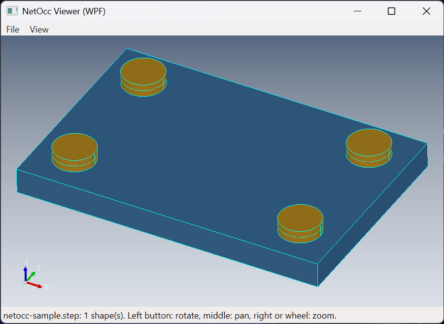
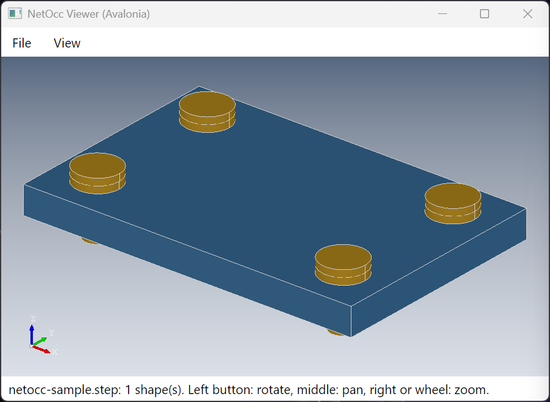

# netocc-demos

Two viewers on the packed NetOcc: WPF and Avalonia 12 host the same OCCT view and open STEP files with their colors, names and assemblies. Windows only: the view is a Win32 child window.

| WPF | Avalonia 12 |
|---|---|
|  |  |

## Run

```bash
cd ../netocc-core && python build.py pack --rids win-x64,win-x86 && cd ../netocc-demos   # the packages the demos restore
dotnet build NetOcc.Demos.slnx -c Release
src/NetOcc.Viewer.Wpf/bin/Release/net10.0-windows/NetOcc.Viewer.Wpf.exe --sample
src/NetOcc.Viewer.Avalonia/bin/Release/net10.0/NetOcc.Viewer.Avalonia.exe model.step
```

File > Open STEP opens a file; File > Open sample writes a bolted plate assembly as STEP and opens it, as `--sample` does. The left button rotates, the middle one pans, the right one and the wheel zoom, a click selects.

## Layout

| Project | Content |
|---|---|
| `src/NetOcc.Viewer` | what both share: `OcctViewer` (OpenGL driver, viewer, context, view controller), `StepDocument` (XCAF), `SampleModel`, `ViewerWindow` (the Win32 child window) |
| `src/NetOcc.Viewer.Wpf` | the window in an `HwndHost` |
| `src/NetOcc.Viewer.Avalonia` | the window in a `NativeControlHost` |
| `test/NetOcc.Viewer.Tests` | the parts without a window: the sample's STEP round trip, a file that isn't STEP |
