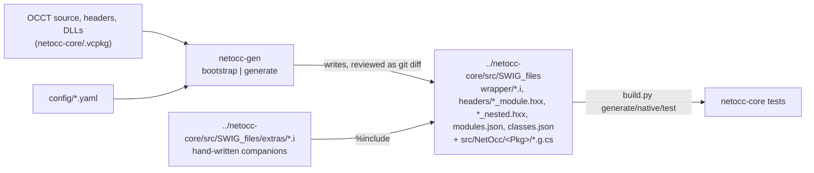

# netocc-generator

`netocc-gen` (C#, net10.0): reads OCCT and writes netocc-core's SWIG interface files, written from scratch. The monorepo's `../netocc-core` consumes the output and defines the wrapper contract
(see its `CLAUDE.md`; monorepo rules: `../CLAUDE.md`).

## Architecture



## Commands

```bash
dotnet build NetOcc.Generator.slnx -c Release
dotnet run --project src/NetOcc.Generator -- --help
dotnet run --project src/NetOcc.Generator -- bootstrap --occt-src ../netocc-core/.vcpkg/buildtrees/opencascade/src/V8_0_1-2f604eca2a.clean
dotnet test NetOcc.Generator.slnx -c Release          # unit + golden tests, no OCCT needed
NETOCC_UPDATE_GOLDEN=1 dotnet test NetOcc.Generator.slnx -c Release   # rewrite test/.../Golden/expected after an intended change, then review the diff

# regenerate netocc-core's generated modules (then in netocc-core: build.py generate, native, test)
# --occt-lib (OCCT's DLLs, for the export check) defaults to <occt-include>/../../bin; run on Windows
dotnet run --project src/NetOcc.Generator -c Release -- generate   --occt-src ../netocc-core/.vcpkg/buildtrees/opencascade/src/V8_0_1-2f604eca2a.clean   --occt-include ../netocc-core/.vcpkg/installed-x64-windows/x64-windows/include/opencascade   --core ../netocc-core
dotnet run --project src/NetOcc.Generator -c Release -- generate --check ...   # exit 1 if netocc-core's files are out of date
dotnet run --project src/NetOcc.Generator -c Release -- dump --occt-src ... --occt-include ... TDF   # what the parser sees
```

## Status

- **`bootstrap`** (`Bootstrap.cs`): works. Parses OCCT's `src/MODULES.cmake`, `<Module>/TOOLKITS.cmake` and `<Module>/<TK>/PACKAGES.cmake`, and writes `config/toolkits.yaml`.
- **`generate`:** writes 362 packages: five OCCT modules and Visualization's TKService, TKV3d, TKOpenGl (`classes`: the driver) and TKMeshVS (`exclude_packages`: the platforms' window packages, resources without headers), the three `alias_packages`, `src/SWIG_files/modules.json` (the modules per OCCT module, in toolkits.yaml order: one native library each), `src/SWIG_files/classes.json` and `headers/`.
  - **`classes.json`** (`Emit/ClassIndex.cs`): the types each package gives C#, for netocc-documentation's class index: C# name, the reference manual's page kind (`class`, `struct` from `ClassModel.IsStruct`, `enum`, `namespace`), the C++ name it documents, an enum's header, and `instance` for collections and template instances, which link to their template (`ClassModel.Template`: the C++ name without arguments; the outer class for a non-public template). A run over some packages keeps the others' entries. netocc-core builds them all; its tests pass on win-x64/x86 across all frameworks. A run takes about 80 seconds; packages parse in parallel.
  - **Config:** `generate` names modules, toolkits or packages, in any order; `exclude_packages` drops some. `alias_packages` (TColgp, TColGeom, TColGeom2d) are packages OCCT 8 dropped whose collection aliases remain: modules with collections only, each with the OCCT module it belonged to.
  - **Companions:** what can't be derived (lifetime typemaps, value-type thunks, `%extend`) is hand-written in netocc-core's `src/SWIG_files/extras/<Pkg>.i`. When that file exists, the module includes it after the enums, before the classes.
  - **Other modules:** `.i` files a run doesn't write (hand-written, or generated earlier when only some packages are passed) are scanned for the types they provide (`TypeRegistry.ScanHandWritten`).
  - **Skips:** skipped members go to `log/skips/<Package>.txt` with a reason.
  - **Stale outputs:** a package's `.g.cs` structs and nested header that a run no longer writes are deleted (`--check`: reported).
  - **Config keys** per package: `classes` (null: all, `[]`: enums only; listing a class lists its nested types; the parse takes only these file-scope classes and the value types, so the others add no instances, typedef names or nested types; the class template instances a package owns are always its),  `exclude_classes`, `exclude_methods` (`Class::Method` or `Namespace::Function`, all overloads), `exclude_namespaces` (dropped from the parsed model: StepFile's bison parser `step`), `prelude`, `value_types` (C# structs in netocc-core).
  - **Collections:** instantiations of Array1/2, List, Sequence, their handle-managed variants, the four maps, OCCT 8's `LinearVector`, `DynamicArray`, `FlatMap` and `FlatDataMap`, and `math_VectorBase`, each named by an OCCT alias (OCCT 8's deprecated ones; `math_Vector`) and emitted in the alias's package.
    - One no alias names gets a name of its own (`TypeRegistry.Instantiation`: `NCollection_Array1_BRepGraph_NodeId`, a default hasher left out), unowned until the first writer pass; then `AssignOwners` gives it to its first user in package order, or to its template's package when it holds numbers only (`NamedType.TemplatePackage`), its unowned dependencies along.
    - Aliases come from `src/Deprecated/NCollectionAliases/<Pkg>_*.hxx`, parsed with the package (typedefs only, never in the module header). The first alias in package order names an instantiation.
    - Only what members use is instantiated. A first writer pass collects the uses (`GeneratedModule.Collections`, `TypeRegistry.Request`; a handle-managed one requests its base), a second the imports, a third writes. A run over some packages keeps what their current `.i` instantiates.
    - Arguments (`CollectionTemplate.Arguments`) are elements or hashers. Elements: fixed-width numbers (not `long long`, spelled per platform), known enums, value types, value classes, strings, GUIDs, handles of transients, plain collections and handles of handle-managed ones. Hashers are C++ only. An argument that holds a comma goes through `%arg` (SWIG macro arguments end at commas). Arrays need default-constructible elements; numbers and value types make an Array1 `_blittable` (bulk copies).
    - A package emits each collection after the ones it needs (base, collections among its arguments), then by alias.
  - **Value types:** 42 configured structs (all of `gp` but the static class `gp`, `Bnd_Box(2d)`, `Quantity_Color(RGBA)`, `Poly_Triangle`), generated as netocc-core `src/NetOcc/<Pkg>/<Type>.g.cs` plus thunks in the `.i`. Members the hand-written partial `<Type>.cs` declares are left out; `Emit/HandWritten.cs` reads the partial with Roslyn.
    - Plain data becomes a struct too (101), its fields public in C#: no bases, virtuals, user-declared copies or destructor, no bit fields (their packing is the compiler's: `MeshVS_TwoColors` is 8 bytes on MSVC, 9 by its fields), and every field public and a number, an enum, a value type or plain data (`Geom_Curve::ResD1`: a point and a vector).
    - Its layout must hold on every target, and libclang computes it for win-x64: no `size_t` (the typedefs tell; it's `unsigned long long` here), `long`, `wchar_t`. A `std::array<T, N>` field is the `T[N]` it holds (`Roots_0`).
  - **Nested and namespace types:** flat names, the scopes joined by `_` (`Geom_Curve::ResD1` is `Geom_Curve_ResD1`), declared as C++ aliases in the generated `headers/<Pkg>_nested.hxx`. `std::` and `opencascade::` keep theirs.
    - Nested enums are `enum class` in the `.i`: their constants are unique only in their scope. A default argument naming one (`Kind::Solid`) is rewritten to the flat name.
    - A flat name that is also a file-scope name (`BVH::RadixSorter`, the class template `BVH_RadixSorter`) stays out, logged.
  - **Template instances named by an alias** at file scope in the template's own header are classes of that name: `using BRepGraph_FaceId = BRepGraph_NodeId::Typed<Kind::Face>;` (plain data, a struct), `BRepGraph_FaceIterator` (a class). Every unit that sees the template sees the alias, so all packages agree; `Convert` names the instance by it.
    - libclang can't instantiate: a class the headers never instantiate has no members. The package then parses again with a `static_assert(sizeof(::Alias) != 0)` per such alias after the includes, in rounds (an instantiated class may use more); one that doesn't instantiate stays out, logged (its error, or a note of it, points at its line), and so does a round that breaks a header.
  - **Other class template instances** public signatures use (`Collector.Track`: OCCT templates, not collections, handles, std or the range-for iterators) are classes of the package too (`CollectInstances`, a worklist): they keep their template form in signatures, and the registry resolves them to the class (`TypeRegistry.Resolve`, everywhere, collection arguments included: SWIG takes the alias and the template for different types).
    - **Names:** an OCCT alias anywhere (the first in package order), a public typedef in a class (`ShapePersistent_Geom::Curve`, also one in a typedef'd instance or its bases; not where its flat name is taken at file scope), else `NamedType.InstanceName` (`BRepGraph_MutGuard_BRepGraphInc_VertexDef`; past 100 characters, the template and a hash: SWIG writes a file per class). A class inside an instance is `<instance>_<class>`.
    - **Owner** (`Generate.OwnInstances`): the first user in package order, or the template's package for numbers only; its nested header declares the name (`ClassInstance.Alias ?? Spelling`), with the headers of the template and its arguments.
    - **Out:** a protected or private template no public typedef names, arguments that differ per platform (`size_t`: a C++ alias can't spell them for every platform), an instance that doesn't instantiate.
    - **Check parse** (`PackageParser.WithBrokenMembers`): an explicit instantiation of each instance instantiates every member. A member whose body has an error for it (`IntPolyh_Array<T>::Dump` calls a `T::Dump()` some T lack) is `Broken`, laid by the error's instantiation note at the instance's line; a vtable naming a function that doesn't link rules out the constructors and copies (`UnlinkedVtable`: the bodies now name their callees).
    - Member default arguments stay uninstantiated in an instance: `UninstantiatedDefaultArg` tells there is one.
    - A non-type argument is a `ConstantArgument` (`Demo_TypedId<3>`, an enumerator by its flat name); a template in an instance (`DynamicArray<T>::DynamicIterator<true>`) is unsupported.
  - **Enums** keep C++'s underlying type (`%typemap(csbase)`; values from `UnsignedInitVal`, since `InitVal` sign-extends). `T&` parameters of a non-int enum are skipped: the ref slot is an int.
  - **Next (Phase 2):** Linux and macOS through CI.
  - **Pipeline:**
    1. `Parsing/PackageParser.cs` (the parse; `.Collector.cs`: declarations to the model, link checks; `.Types.cs`: types and names): libclang, one translation unit per package, function bodies included; the declarations of that package's headers (nested and namespace ones included), with fields (and, for value types and plain data, the members of class-typed fields). `Parsing/LibraryExports.cs` reads OCCT's DLL export tables.
    2. `Mapping/SignatureMapper.cs`: contract mapping (C++ spelling, C# type) or a skip reason.
    3. `Emit/InterfaceWriter.cs`: writes `<Pkg>.i` and `<Pkg>_module.hxx`. Order in the `.i`: imports (the closure, never the module itself), `%netocc_csimports` (their C# usings), typemap macros (the classes', then the `ModuleContext.Typemaps` its declarations need), layout guards, enums, the companion, collections, classes, value-type thunks, namespace-function shims. SWIG applies typemaps only to later declarations, so the collections precede the classes. `Emit/ValueTypeWriter.cs` writes the structs. A `ModuleContext` collects what a module's declarations use, the typemaps they need and the skip log. Both writers follow `Emit/ClassRules.cs` (what a class becomes: proxy, struct or nothing) and `Emit/MemberRules.cs` (`Declarable`: move twins, rejections and ambiguous calls, the checks every member loop runs first; `MapParameters`; defaults, parameter names); `Emit/GeneratedText.cs` holds the SPDX header and the LF rule.

## Rules

- **Mapping rules** (learned in Phase 0):
  - Emit a member only if every type in it is wrapped or covered by a typemap; otherwise skip it and log why.
  - **Overloads that collide in C#** (default-argument overloads included) are one call (`InterfaceWriter.Claim`): a twin returning a C# `ref` to a value (`TwinRank`; not a pointer slot), then the one with more UTF-16 strings (`MappedMember.Utf16`), then the first declared. A member whose full signature is claimed is covered, no skip; one whose shorter default overloads are claimed keeps its defaults past them. Class returns keep declaration order: a view's copy holds a raw pointer to its graph, an iterator's borrowed item outlives neither the iterator nor the list.
  - **Name clashes:** a member named like its class, or like the proxy's `Dispose`, `Finalize` or `MemberwiseClone`, is skipped. `GetType` is wrapped: it hides `object.GetType()`, which isn't virtual.
  - Put all `%occt_transient`/`%occt_valueclass` lines before the first declaration. Every value class gets `%occt_valueclass`, even one without constructors or instance members: a static member's `const&` return of it must copy (the borrowing `csout` sets `netoccOwner = this`).
  - Derive from the nearest wrapped ancestor.
  - Leave out `wchar_t` (no fixed width). OCCT's legacy `Handle_T` classes are covered by T's proxy: no proxy, no skip (`ClassRules.IsCovered`).
  - **Exception classes** (`Standard_Failure` and its subclasses: copyable `std::exception`s in OCCT 8) are ordinary classes; a thrown one still reaches C# as `OcctException`.
  - **Deprecated** (`Standard_DEPRECATED`) classes and members are wrapped and `[Obsolete]` (`MemberRules.CsObsolete`: our own message, OCCT's stays out of the output).
    - A class through `%typemap(csattributes)`: `%csattributes` on the class name marks its constructor instead.
    - A member through an in-class `%csattributes` with its declared parameters, defaults and `const` (`MemberText.Signature`): SWIG matches that overload and its default overloads only.
    - A namespace function before the shim's `%inline` (its text reaches the compiler); a struct member on the C# member.
  - Drop trailing `Message_ProgressRange` defaults.
  - **Standard library types** (`SignatureMapper.Std`): strings and string views, a const string stream (its text), stream positions, bitsets (N ≤ 64), arrays of numbers C# pins as they are (`BlittableBuiltins`: not bool or char, nor 64-bit integers, whose canonical names C++ spells per platform), optionals of numbers, enums (a nested one by its qualified name) and structs, `std::complex<double>`. A bitset, array or optional instantiation calls its netocc-core macro (`MappedType.Typemap`).
    - `std::pair` is a collection template (`%netocc_pair`, `Include: "utility"`): named by a class-scope alias (pairs' only: file-scope aliases such as `TColgp_Array1OfPnt` come first, and traits' typedefs say less than a synthesized name), else `std_pair_<T1>_<T2>`. An argument with commas goes through `%arg`; an element's macro (a bitset's) goes into the owner module (`CollectionElement.Typemap`); a nested enum element is out (`%extend` casts).
  - **What C# can't pass, left to C++:** a parameter that doesn't map, when it and every one after it have defaults, ends the declaration (logged, `MemberRules.MapParameters`).
  - **Default arguments** go into the `.i` as written (`Collector.DefaultText`). One spelled in a macro body (`DEFINE_STANDARD_EXCEPTION`'s `theMessage = ""`, `INT_MAX`; spelling and file locations differ) has no tokens there: its constant's value (`clang_Cursor_Evaluate`), for number, bool and C string parameters only, since shims and thunks compile it. Otherwise it's dropped, logged.
  - **Links:** a member is callable when it is pure virtual, in OCCT's export tables, a template instance (the shim instantiates it), or defined in a header with calls that link themselves.
    - OCCT declares some `Standard_EXPORT` members it never defines, and StepFile_ReadData's inline destructor calls the unexported `ClearRecorder`.
    - Constructors and destructors are looked up by all their manglings: for an MSVC destructor, `getMangling` names `??_D`, while the DLLs export `??1`.
  - **Vtables:** an inline constructor (or an implicit copy) of a polymorphic class the libraries don't export makes MSVC emit the vtable in the shim, and the vtable names every virtual function. One that doesn't link (ShapeAnalysis_BoxBndTreeSelector::Reject) rules out that constructor and the copies; an exported constructor sets OCCT's vtable and stays.
    - An inline delegating constructor of a class whose virtual functions the libraries export makes MSVC take the vtable from them instead of emitting it; where they don't export it (`IsVtableUnexported`, from the export tables, so Windows only), the constructor is left out (`Select3D_SensitiveCircle`'s deprecated one). Other inline constructors of such classes emit the vtable and link.
  - **Destructors must link** (Storage_Bucket's isn't exported). Without one, a non-transient class gets `%nodefaultdtor`, no constructors and no by-value returns; an owning proxy's finalizer would throw `MethodAccessException`.
  - A public `using Base::Member;` makes the base's overloads members of the class. OCCT re-exposes protected bases this way (`BRepAlgoAPI_Algo`: `HasErrors`).
  - **Headers:** `<Pkg>_module.hxx` includes dependency headers before the package's own, because some OCCT headers use types they don't include.
    - A package header that doesn't compile, or includes one that doesn't (a missing `.pxx`, a bug in an inline function), is left out with a log line.
    - Windows-only headers are left out too: generated on Windows, the output builds everywhere. OCCT names them after WNT (`OSD_WNT.hxx` includes `windows.h`); portable headers guard their `windows.h` with `_WIN32`.
    - A missing include is fatal in clang and hides the headers after it, so the header that led there goes and the package parses again.
    - `prelude` in `modules.yaml` includes the missing header first, in every package that uses the headers too.
  - **Types used by other packages** are included from their declaring header (`NCollection_ForwardRangeSentinel` lives in another file). The directory above OCCT's includes holds its third-party headers (rapidjson).
  - **Creation:** a class that declares only placement forms of `operator new`/`delete` (NCollection-allocated nodes), or reaches them through a protected base (`Message_LazyProgressScope`), gets no constructors and `%nodefaultdtor`, and is never copied into a proxy.
  - **Default constructor:** without a usable `T()`, a class gets `%nodefaultctor` and `valuewrapper`. SWIG gives a class without declared constructors a default one and default-constructs by-value results.
  - **Move-only** classes (`ClassTraits.IsMovable`, not copyable): a by-value return moves into an owned proxy through `valuewrapper` (netocc-core builds with `/Zc:__cplusplus`, which `SwigValueWrapper`'s moves need on MSVC).
  - **Range-for:** a class whose `begin()`/`end()` return `NCollection_ForwardRangeIterator`/`Sentinel` gets `%occt_forward_range(Class, T, Accessor)` (IEnumerable over More/Next and the first of Value/Current/CurrentId, as OCCT's `AccessorTraits` picks); begin/end are left out, covered.
  - **Move twins:** an overload taking `T&&` where another takes `const T&` or `T`, the rest the same, is covered: C# calls the other (`IsMoveTwin`), no skip.
  - **Covered, not logged:** members a value type's partial declares (managed), classes that are .NET types (strings, GUIDs) or legacy `Handle_T` classes, overload twins. The skip log holds only what C# can't reach.
  - A `const Enum&` parameter is declared by value: SWIG's temporary for it is an elaborated `enum X`, which a nested enum's flat alias can't follow.
    - A class that declares none and isn't abstract gets its implicit `T()` as a constructor (the parser adds it). It's inline: it links when the vtable rule allows and the bases' and members' default constructors link.
  - **References:** a non-static member's `T&` return maps (netocc-core's References.i): numbers, enums and structs as C# `ref`s, classes and plain collections as borrowing proxies, a `Handle(T)&` as the object, and its own class as `void` (chaining). So does a `const T&` of a class that isn't copyable. Static functions and value-type thunks (a ref into a C# struct could move) return none.
  - **Streams:** a `std::basic_ostream<char>&`/`std::basic_istream<char>&` parameter is `std::ostream&`/`std::istream&` in the `.i`, a C# `Stream` (netocc-core's Streams.i), and so is a pointer to one (`nullptr`: `null`). Constructors and classes with a stream member may keep it, so they get none; a function that returns the stream it was given returns `void`. A returned native stream is skipped.
  - **Pointers** (`SignatureMapper.Pointer`, `ReturnedPointer`, `PointerReference`; netocc-core's contract):
    - A class or collection is its proxy. A member's returned one is spelled `T*` (References.i borrows, owner kept), one without an object `T* const` (no owner), a transient's always `T* const` (constructors return `T*`, and Handles.i's reference would count twice).
    - Numbers and structs are C# arrays, unless a constructor or `Set*` method takes them (`InterfaceWriter.MayKeep`): a pinned array would dangle. Then they're addresses, as are functions, pointers to pointers and returned number pointers: `NetOcc_Address< T >`, with a `%netocc_address(%arg(T))` call in the module (`void*` is an `IntPtr` as it is). `T*&` of those is `NetOcc_AddressRef< T >`.
    - A class a translation unit only declares (`NamedType.DeclaredOnly`) is the class another package defines; if none does, a pointer to it is an opaque address under C++'s qualified name.
    - Width typedefs keep their name in pointer spellings (`BuiltinType.Written`): `int64_t*` is `long*` on Linux, `intptr_t*` `int*` on x86. Parameters declared as arrays decay (`gp_Pnt theP[8]` is `gp_Pnt*`); arrays of arrays are declared as written (`MappedType.Declared`).
    - Value-type thunks take `theSelf` by reference; a member returning a pointer into the struct is skipped, since the GC may move it.
  - **Copies:** a class copies when its copy constructor is user-provided and public, or defaulted with copyable bases and fields. NCollection containers copy their elements (`NCollection_Sequence<CSLib_Class2d>` doesn't).
  - **Ambiguous calls** (`MemberRules.Declared`): an arity whose call another overload also takes (the same first arguments, the rest defaulted) is left out, as C++ can't make it either; the member keeps its other arities (`IntPolyh_Array(int = 256)`: `()`; `(int, int = 256)`: `(int, int)`), and is skipped only when none is left. Non-public overloads count, since C++ checks access after overload resolution (`BOPAlgo_ParallelAlgo::Perform`); the parser names non-public constructors `""` (`MemberRules.HiddenConstructors`: an alias may rename the class). Trailing `Message_ProgressRange` defaults are dropped where the call stays unambiguous. A declaration's defaults run to its end, so a callable arity below an ambiguous one is left out, logged.
  - **Accessors** (`InterfaceWriter.Accessor`): a return SWIG can't give as declared goes through an `%extend` member `NetOcc_<Name>`, renamed `<Name>`: a transient by value is `new T(call)` (C++17 elides the copy: it needn't be copyable), owned by its proxy; a static member's class reference `&call`, a borrowed proxy without owner.
  - **Mutable twins:** a member returning a mutable reference next to one taking and returning the same types const (`TopoDS::Face(TopoDS_Shape&)`), or returning the value (`Image_ColorRGB::r() const`), is covered (`MemberRules.HasConstTwin`); a mutable string reference returns a copy; a struct method returning its own struct (chaining) is void.
  - **Kept arguments** (`InterfaceWriter.IsKept`): a parameter of a class or collection by reference or pointer that the class refers to (`ClassModel.Held`: the parser's pointer and reference fields of the class and its bases, any access, template instances too, not collections or std; a base of the argument's class counts; proxies only: not handles, std types, strings, structs or addresses, whose typemaps the keep one would override). netocc-core's References.i keeps it alive with the proxy.
    - Constructors: `%apply SWIGTYPE & NETOCC_KEEP { decl }` (`*` for pointers) before the declaration and `%clear` after, and the class `%netocc_keep_construct(Class)` (by-value returns of the class keep the member's object too).
    - Non-static, non-const members: `%netocc_keep_argument(Member.index, decl)` per argument (`%arg` around a template), then `%clear`: the slot a later call replaces.
  - **C arrays by reference** (`int (&)[3]`): `NetOcc_ArrayRef< T, N >` with `%netocc_array_ref(T, N, CS)` for the elements `std::array` takes, `%netocc_bool_array_ref(N)` for bool.
  - **Window-system handles** (`Aspect_Drawable`, `Aspect_Handle`, `Aspect_RenderingContext`, `Aspect_Display`, `Aspect_FBConfig`): the parser keeps them by name as pointer-sized builtins (`WidthTypedefs`), and the `.i` spells them so by value too (`SignatureMapper.ValueSpelling`): `void*` on Windows, `unsigned long` on X11. Keyed as `void*` for overloads (both are `IntPtr`); a pointer to one is an address (Types.i has no arrays of them).
  - **Shadowed members** (`InterfaceWriter.Shadows`): an instance member next to a wrapped static overload taking the object first and the same arguments after is skipped: SWIG passes the object as the first argument and can't tell them apart. Compared as SWIG does, C++ types without const and references: a handle of the class is another type (`Message_ProgressIndicator::Start()` stays).
  - **Numbers by reference:** every fixed-width integer (`RefBuiltins`), a width typedef by its written name, `char` as its byte (by value too, keyed as `unsigned char`), `char32_t` as a `uint` (keyed as `unsigned int`), `size_t&` (a member's `size_t&` return a `ref UIntPtr`), C `long` (by value, `const&` and `&`, keyed as `long long`: C# can't tell them apart), `Standard_GUID&`. A transient's `T&` is its proxy, like `const T&`.
  - **Enums in class template instances** (`BVH_Tools<double, 3>::BVH_PrjStateInTriangle`) are enums of their first user, `<instance>_<Enum>`, declared in its nested header by C++'s spelling.
  - A `= {}` default is written `TYPE()` (a pointer's `nullptr`): SWIG can't parse braces, and shims compile the default.
  - A nested class defined out of line (`class BRepGraph::ShapesView` at file scope) comes with its class, not as a file-scope one.
  - The handle root `Standard_Transient` gets `%occt_handle` and no base; the reference-count members stay unwrapped (`exclude_methods`).
  - Namespace functions become a static class named like the namespace: `%rename(<Ns>) <Ns>::NetOcc_<Ns>` on an `%inline` struct of forwarding static methods, inside the namespace so default arguments resolve as declared.
- **Output contract:** whatever netocc-core's typemap library expects (`%occt_transient`, `%occt_handle(T, T)` for the root, `%occt_valuetype`, `%occt_valueclass`, the collection macros `%occt_array1[_blittable]`, `%occt_array2`, `%occt_list`, `%occt_sequence`, `%occt_harray1`, `%occt_harray2`, `%occt_hsequence`, `%occt_math_vector` with `(NAME, TYPE, CSTYPE)` and the maps `%occt_map`, `%occt_indexedmap` `(NAME, KEY, HASHER, CSKEY)`, `%occt_datamap`, `%occt_indexeddatamap` `(NAME, KEY, ITEM, HASHER, CSKEY, CSITEM)`, OCCT 8's `%occt_linearvector[_blittable]`, `%occt_dynamicarray`, `%occt_flatmap`, `%occt_flatdatamap`, `%occt_forward_range(Class, T, Accessor)`, `%netocc_address(%arg(T))` and `%netocc_address_ref(%arg(T))`, `%netocc_csimports`, `%csattributes` and the `csattributes` typemap for deprecated members and classes, `NetOcc_<Type>_<Method>` thunks, `static_assert` layout guards). Change the contract in netocc-core first.
- **Deterministic, declarations-only output:** stable ordering, no timestamps. OCCT doc comments appear only with `--docs`, never in committed files or golden fixtures.
- **Clean-room:** other OCCT binding generators (GPL-3.0) serve for rules at most; never copy their code or exclusion lists. The generator stays MIT.
- **Never edit `config/toolkits.yaml`;** re-run `bootstrap` on OCCT upgrades and review the diff.
- **Git:** the monorepo's (`../CLAUDE.md`): `main` is a single commit on github.com/paulbuechner/netocc, amended with `git commit --amend --no-edit`; the user pushes. CI: `../.github/workflows/generator.yml`, on changes under `netocc-generator/`.
- **C#:**
  - Modern language features: file-scoped namespaces, collection expressions, primary constructors, `GeneratedRegex`.
  - Never implicit usings.
  - Using groups, blank-line separated, IDE order within each group:
    1. `System*` (no comment);
    2. each third-party package under `// <Package>`;
    3. `NetOcc.Generator` under `//`;
    4. `using static` under `// static usings`;
    5. `using X = Y;` aliases under `// alias directives`.
  - `.slnx` solutions.
  - Dependencies: ClangSharp 21.1.8.4 with the libclang/libClangSharp runtime packages per RID (referenced directly, so the tool needs no RID), and YamlDotNet for the config. Nothing else without asking.
  - Tests: `test/NetOcc.Generator.Tests`, NUnit 4, `Assert.That`, Arrange/Act/Assert. Mapper and writer tests use synthetic models; parser tests run libclang on a temporary header; `GoldenTests` run `generate` over the fake OCCT tree in `Golden/` and compare with `Golden/expected/`. No test needs OCCT.
  - CI: `.github/workflows/ci.yml` builds and runs the unit and golden tests on Windows, Linux and macOS (identical golden output on all three).
- **License headers:**
  - Source code files only (`.cs`, and the `.i`/`.hxx` that `generate` writes) start with `SPDX-FileCopyrightText: 2026 Paul Büchner` + `SPDX-License-Identifier: MIT`.
  - None in project and config files: `.csproj`, `.slnx`, `config/*.yaml` (`bootstrap` writes `toolkits.yaml` without one).
