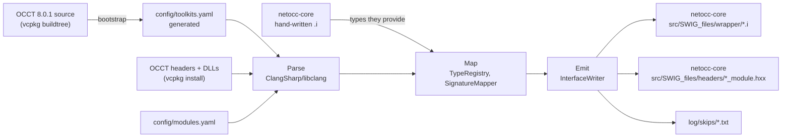

# netocc-generator

Generates the SWIG interface files for [netocc-core](../netocc-core): one `.i` per OCCT package, plus the
value-type structs and native thunks. Written from scratch (MIT).

Part of the [netocc monorepo](../README.md):

| Folder | Role |
|---|---|
| netocc-generator | reads OCCT, writes netocc-core's `src/SWIG_files/{wrapper,headers}`; runs on OCCT upgrades |
| netocc-core | commits that output (declarations only, no OCCT doc text) and builds without this folder |

Status:
- **`bootstrap`:** works.
- **`generate`:** Phase 2 (in progress). Writes the 362 packages of OCCT's FoundationClasses, ModelingData, ModelingAlgorithms, ApplicationFramework and DataExchange modules and of Visualization (TKService, TKV3d, TKOpenGl's driver, TKMeshVS), with the collection instantiations their signatures use (arrays, lists, sequences, maps, `math_Vector`; named by OCCT's aliases); netocc-core builds them and its tests pass on win-x64/x86. What can't be derived (lifetime typemaps, value-type thunks) lives in netocc-core's hand-written `src/SWIG_files/extras/<Pkg>.i`, which the generated modules include.

## Architecture



| Pass | Does |
|---|---|
| Parse | one libclang TU per package, in parallel, function bodies included, plus the package's collection aliases (`src/Deprecated/NCollectionAliases`); public classes, enums, typedefs, namespace functions; `using Base::X;` members; layouts and fields; headers that don't compile left out; members checked to link (OCCT's DLL export tables, what inline definitions call, the vtables inline constructors set) |
| Map | only wrapped or typemapped types (generated packages plus netocc-core's hand-written `.i`); C++ `&` -> C# `ref` (enums too); collections an alias names, holding elements C# can hold; every skip logged with a reason |
| Emit | three passes (the collections members use, the imports, the files). `.i` (typemap macros, layout guards, enums, companion include, collections, classes bases first, namespace shims), `_module.hxx` (dependency headers first), `modules.json`; deterministic |

Planned (Phase 2): Linux and macOS through CI.

## Commands

```bash
# toolkit -> package map from the OCCT source (vcpkg keeps it under .vcpkg/buildtrees/opencascade/src/)
dotnet run --project src/NetOcc.Generator -- bootstrap --occt-src <OCCT source root>

# writes ../netocc-core/src/SWIG_files/{wrapper,headers,modules.json} for config/modules.yaml's packages; --check only compares
dotnet run --project src/NetOcc.Generator -c Release -- generate --occt-src <OCCT source root> --occt-include <include/opencascade> --core ../netocc-core

# unit and golden tests (no OCCT needed); NETOCC_UPDATE_GOLDEN=1 rewrites the expected files
dotnet test NetOcc.Generator.slnx -c Release
```

CI (`../.github/workflows/generator.yml`, on changes under `netocc-generator/`) runs the same tests on Windows, Linux and macOS.

## Config

| File | Owner | Content |
|---|---|---|
| `config/toolkits.yaml` | `bootstrap` (don't edit) | OCCT modules -> toolkits -> packages (OCCT 8.0.1: 6 modules, 54 toolkits, 374 packages) |
| `config/modules.yaml` | hand-edited | modules, toolkits or packages to generate (any order), `exclude_packages`, `alias_packages`; per package `classes`, `exclude_classes`, `exclude_methods`, `prelude`, `value_types` |

No code or lists from other OCCT binding generators are copied.

License: MIT, see `LICENSE`.
